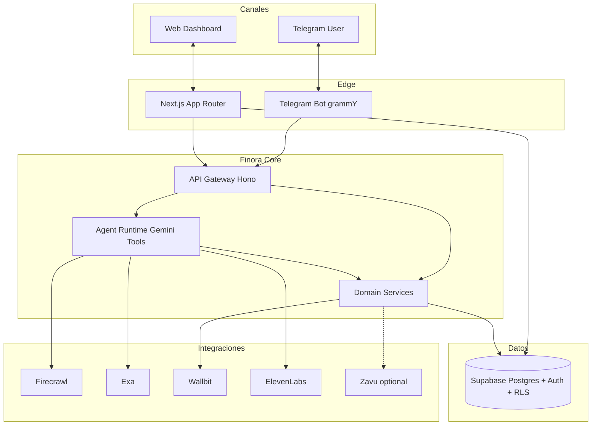
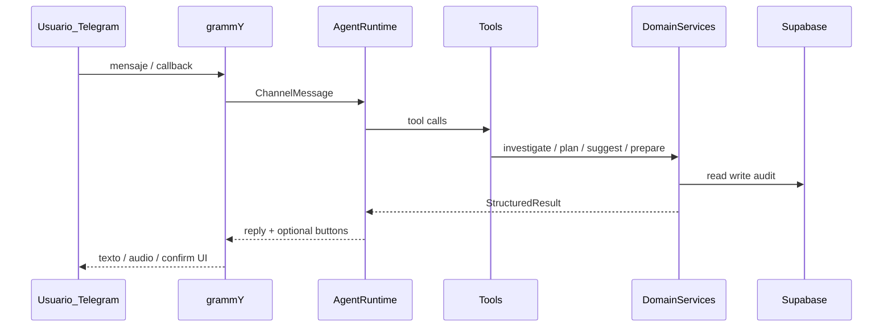
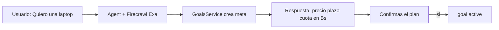

# Arquitectura y flujo — Finora

Spec del sistema: agente IA compartido, bot Telegram (grammY) como canal conversacional principal, dashboard web para metas/progreso/confirmaciones Wallbit, Supabase, APIs e integraciones.

## Decisiones cerradas

| Decisión | Elección |
|----------|----------|
| Chat principal | Telegram Bot API vía **grammY** |
| Web | Dashboard (metas, progreso, confirmar Wallbit); **no** chat competidor en MVP |
| Notificaciones push extra | **Zavu opcional/secundario** (Telegram cubre alertas in-bot) |
| Persistencia / auth | Supabase |
| Mercado / moneda | **Bolivia**, **Bs = pesos bolivianos (BOB)** |
| Dinero real | Solo preparar; ejecutar tras confirmación humana (web o callback Telegram) |
| API HTTP | Hono (preferido) sobre Node ≥ 18 |
| Web app | Next.js App Router + Supabase SSR |

Detalle de datos: [`data-model.md`](data-model.md). Contratos HTTP: [`api.md`](api.md). Dominio y copy: [`domain.md`](domain.md).

## Vista C4 — sistema



**Principio:** un solo cerebro de dominio + agente; Telegram y Web son adaptadores. El LLM no escribe directo a Wallbit ni a DB sin pasar por domain services con reglas de confirmación.

## Monorepo propuesto

```text
Finora-Agent/
  apps/
    api/                 # Core HTTP + agent runtime + webhooks Telegram
    bot/                 # grammY (puede vivir dentro de api como módulo)
    web/                 # Next.js dashboard
  packages/
    domain/              # metas, microahorros, guardrails, wallbit prep
    db/                  # tipos Supabase, queries
    shared/              # schemas Zod, errores, IDs
  docs/context/          # product, architecture, domain, data-model, api
  supabase/migrations/   # SQL versionado
```

## Capas internas del agente



### Agent Runtime

- **Orquestador:** Gemini (chat + tool calling vía API compatible OpenAI)
- **Memoria de sesión:** historial corto en Supabase (`conversation_messages`) + resumen de meta activa
- **Tools** (lectura/prep; nunca execute money sin confirmación previa vía `pending_actions`):
  - `research_product_price` → Firecrawl
  - `research_macro_context` → Exa (FX BO, inflación, noticias)
  - `get_active_goal` / `create_or_update_goal`
  - `suggest_microsaving`
  - `evaluate_withdrawal_guardrail`
  - `prepare_wallbit_conversion` → crea `pending_action`
  - `generate_voice_summary` → ElevenLabs (URL/archivo)
- **System prompt:** pilares Finora + contexto Bolivia/Bs + “informar, no bloquear” + no inventar precios

### Domain Services (sin LLM)

| Servicio | Responsabilidad |
|----------|-----------------|
| `GoalsService` | CRUD metas, progreso, cuota |
| `MicrosavingsService` | propuestas y aplicación tras confirmación |
| `GuardrailsService` | impacto en meses al retirar |
| `PendingActionsService` | cola Wallbit / movimientos; `pending\|confirmed\|cancelled\|expired\|failed` |
| `MarketContextService` | cache corto de precio/FX desde Firecrawl/Exa |
| `NotifyService` | envío Telegram nativo; Zavu solo si está configurado |

## Stack de integraciones

| Capa | Tecnología | Responsabilidad |
|------|------------|-----------------|
| Conversación / razonamiento | Gemini (Google AI) | Cerebro del agente |
| Chat principal | grammY + Telegram Bot API | Canal conversacional |
| Dashboard | Next.js | Metas, progreso, confirmaciones |
| Precios de productos | Firecrawl | Scraping / extracción de precios reales |
| Contexto económico | Exa | Macro, noticias, mercado (contexto BO) |
| Patrimonio / divisas | Wallbit | Consulta patrimonio; preparar protección de ahorro |
| Notificaciones extra | Zavu (opcional) | Push secundario multi-canal |
| Audio | ElevenLabs | Resúmenes financieros por voz |
| Persistencia | Supabase | Metas, progreso, historial, sesiones |

## Flujos por canal

### A) Telegram — definir meta y plan



### B) Microahorro

1. Agente o job detecta margen → `suggest_microsaving` → mensaje con botones Sí/No
2. Sí → `goal_transactions` + actualiza `accumulated_bobs`
3. No → solo log

### C) Guardrail de retiro

1. Usuario pide retirar X de la meta
2. `GuardrailsService` calcula meses de retraso
3. Mensaje asertivo + confirmar
4. Si confirma → transaction `withdrawal` (nunca bloqueo silencioso)

### D) Wallbit — prep en Telegram, confirmar en Web o bot

1. Agente llama `prepare_wallbit_conversion` → fila `pending_actions`
2. Telegram: resumen + botones **Confirmar aquí** | **Abrir dashboard**
3. Web: tarjeta pendiente → `POST /actions/:id/confirm`
4. Domain ejecuta Wallbit **solo** en confirm; audita resultado
5. Si falla: status `failed` + mensaje claro

### E) Dashboard web (sin chat LLM en MVP)

1. Login / vincular Telegram
2. Lista de metas + barra de progreso (Bs)
3. Detalle meta + historial
4. Bandeja de acciones pendientes (Wallbit / retiros)
5. Settings (Telegram, preferencias de voz)

## Bot Telegram (grammY)

- Webhook en prod; long polling solo local
- Comandos: `/start`, `/meta`, `/progreso`, `/ayuda`
- Conversación libre → `POST /agent/turn`
- Inline keyboards → `PendingActionsService`
- Rate limit por `telegram_user_id`
- Sin profile linkeado: vinculación o profile telegram-only + upgrade a Auth web

## Frontend (`apps/web`)

- Next.js App Router; UI de progreso y confirmaciones
- Lectura con Supabase + RLS; mutaciones sensibles (confirm Wallbit) vía API core
- Estado vacío: CTA al bot Telegram + deep link/QR
- Copy en español, montos en Bs (BOB)

## Jobs / proactividad (fase 2)

- Cron: re-check precio Firecrawl si meta activa > N días
- Cron: recordatorio de cuota (Telegram nativo; Zavu solo si multi-canal)
- Opcional: resumen semanal ElevenLabs → audio en Telegram

## Límites de automatización

- **Preparar** conversiones, alertas y sugerencias: sí (agente)
- **Ejecutar** movimiento de dinero o conversión real: solo tras confirmación del usuario
- Persistencia de estado de meta y transacciones: Supabase

## Seguridad

- Service role solo en `api`
- Confirm tokens de un solo uso + `expires_at`
- Nunca ejecutar Wallbit desde tool del LLM sin `pending_actions` + confirm
- Secrets en `.env`; plantilla `.env.example` (nunca commitear `.env`)
- No inventar FX/precios si Firecrawl/Exa fallan

## Variables de entorno (conceptual)

API keys / secrets: Gemini, Firecrawl, Exa, Wallbit, Telegram Bot, ElevenLabs, Supabase (URL + anon + service role). Zavu solo si se habilita el adapter opcional.

## Supuestos / riesgos

- Wallbit: se asume prepare + execute on confirm; si el contrato real difiere, adaptar solo el adapter / `PendingActionsService`
- Usuarios pueden empezar solo por Telegram; el dashboard exige cuenta Auth + link
- Zavu no bloquea el MVP (`NotifyService` con adapter Telegram-only o no-op)
