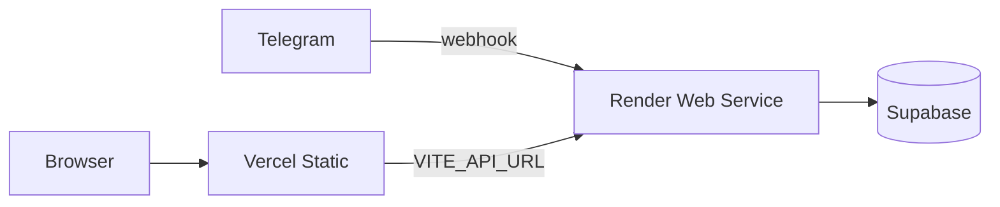

# Deploy — Web (Vercel) + API (Render)

Arquitectura híbrida gratuita (demo / MVP):

| Pieza | Plataforma | Plan |
|-------|------------|------|
| Dashboard Vite (`apps/web`) | [Vercel](https://vercel.com) Hobby | $0 |
| API Hono + Telegram + digest (`apps/api`) | [Render](https://render.com) Free Web Service | $0 (duerme ~15 min idle) |
| Datos | Supabase | el proyecto que ya usás |

Always-on en Render empieza en **Starter ~$7/mes**. Con Free esperá cold starts de 30–60s.



## 1. API en Render

1. Conectá el repo en Render → **New Blueprint** (`render.yaml`) o **Web Service** manual.
2. Build / start (si es manual):

```bash
npm install && npm run build:packages && npm run build -w @finora/api
npm run start -w @finora/api
```

3. Health check: `/health`
4. Environment (mínimo):

| Variable | Valor |
|----------|--------|
| `NODE_ENV` | `production` |
| `TELEGRAM_MODE` | `webhook` |
| `USE_MEMORY_STORE` | `false` |
| `PUBLIC_API_URL` | `https://<tu-servicio>.onrender.com` (sin slash final) |
| `WEB_APP_URL` | `https://<tu-app>.vercel.app` (sin slash final). **Sin esto el dashboard en Vercel falla con “No se pudo conectar”** (CORS). Varios: coma-separados. |
| `SUPABASE_URL` / `SUPABASE_ANON_KEY` / `SUPABASE_SERVICE_ROLE_KEY` | de Supabase |
| `TELEGRAM_BOT_TOKEN` | BotFather |
| `TELEGRAM_WEBHOOK_SECRET` | string random (Render puede generar uno) |
| Keys IA / integraciones | `GROQ_API_KEY`, `FIRECRAWL_API_KEY`, `EXA_API_KEY`, `WALLBIT_API_KEY`, … |

Al arrancar, la API llama `setWebhook` a `${PUBLIC_API_URL}/webhooks/telegram` si `TELEGRAM_MODE=webhook` y la URL no es localhost.

5. Verificá: `GET https://<api>/health` → `ok: true`.

**Sleep Free:** tras ~15 min sin tráfico el servicio se duerme. El primer mensaje de Telegram o request al dashboard puede tardar. Opcional: ping a `/health` cada 10 min desde [cron-job.org](https://cron-job.org) (gratis).

## 2. Web en Vercel

1. [Vercel](https://vercel.com/new) → Import del mismo repo.
2. **Root Directory:** dejar vacío (raíz del monorepo) **o** `apps/web` según cómo configures el build.

### Opción A — root del monorepo (recomendada)

- Framework: Other / Vite
- Build Command: `npm install && npm run build -w @finora/web`
- Output Directory: `apps/web/dist`
- Install: `npm install`

### Opción B — Root Directory = `apps/web`

- Build: `npm install && npm run build` (desde `apps/web`; puede fallar si no hay workspaces — preferí Opción A)

3. Environment (Production / Preview):

| Variable | Valor |
|----------|--------|
| `VITE_API_URL` | Preferí `/v1` (same-origin; `vercel.json` proxea a Render) **o** `https://<tu-api>.onrender.com/v1` |
| `VITE_USE_MOCKS` | `false` |

Con `VITE_API_URL=/v1` no hace falta CORS en el browser. Con URL absoluta a Render, la API debe permitir el origen Vercel (`WEB_APP_URL` o el allow `*.vercel.app` del servidor).

4. SPA + proxy: [`vercel.json`](../../vercel.json) reescribe `/v1/*` → Render y el resto a `index.html`.

5. Después del primer deploy, copiá la URL `*.vercel.app` (ej. `https://finora-agent-api.vercel.app`) a `WEB_APP_URL` en Render y **redeploy** la API (CORS). Sin esa variable el browser bloquea `fetch` al API aunque `/health` responda 200.

## 3. Checklist

- [ ] `/health` en Render OK (`supabase`, `telegram`)
- [ ] Logs Render: `Telegram webhook registrado: https://…/webhooks/telegram`
- [ ] Bot responde `/start` (puede tardar si Free estaba dormido)
- [ ] Dashboard en Vercel carga metas reales (`VITE_USE_MOCKS=false`)
- [ ] Migraciones Supabase al día (incl. `preferences`)

## Local vs producción

| | Local | Producción |
|--|-------|------------|
| Telegram | `TELEGRAM_MODE=local` (polling) | `TELEGRAM_MODE=webhook` |
| Store | `USE_MEMORY_STORE=true` opcional | `false` + Supabase |
| Web API URL | `http://localhost:3001/v1` | URL Render `/v1` |

Ver también [local-dev.md](local-dev.md) y [`.env.example`](../../.env.example).
